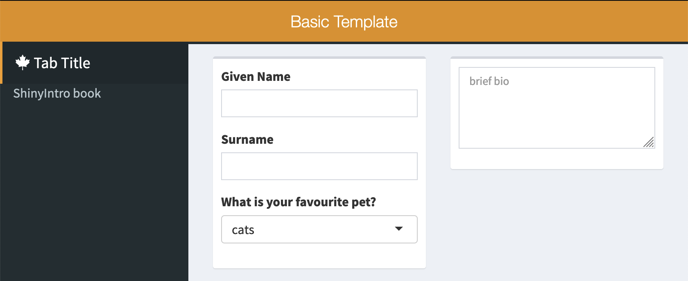
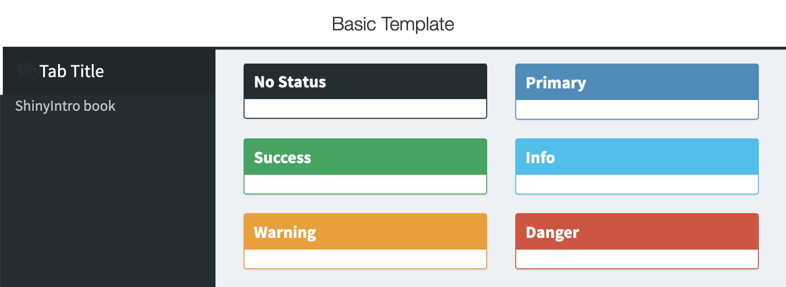
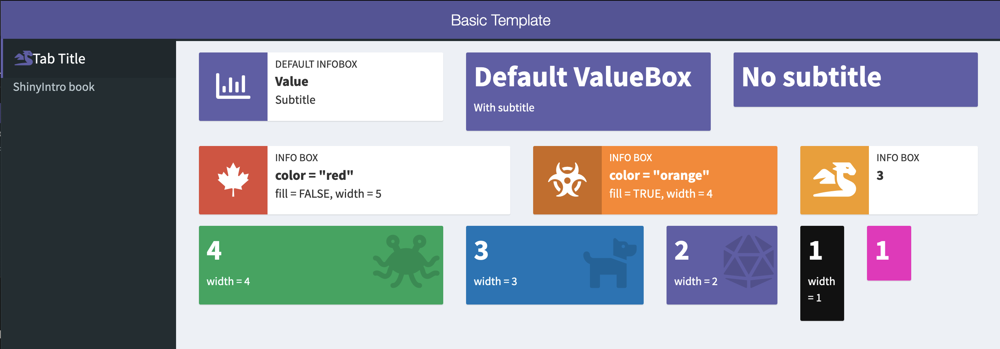
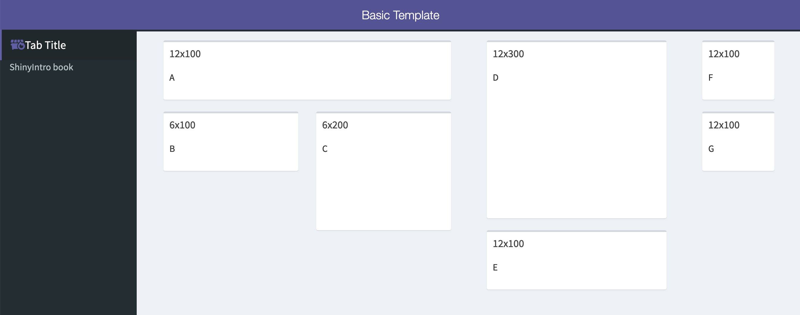

# ShinyDashboard {#shinydashboard}

[Shinydashboard](https://rstudio.github.io/shinydashboard/){target="_blank"} is an R <a class='glossary' target='_blank' title='A group of R functions.' href='https://psyteachr.github.io/glossary/p#package'>package</a> that provides functions to upgrade your Shiny apps into beautiful dashboards.

## Basic template for shinydashboard projects

The shinyintro package provides a basic template for a shinydashboard project.

<div class="figure" style="text-align: center">
<iframe src="https://shiny.psy.gla.ac.uk/debruine/basic_template/?showcase=0" width="100%" height="500px"></iframe>
<p class="caption">(\#fig:basic-template-app)Basic Template App</p>
</div>

You can start a new app using the template with the code `shinyintro::clone("basic_template", "myapp")`. This will create a new directory called "myapp" in your <a class='glossary' target='_blank' title='The filepath where R is currently reading and writing files.' href='https://psyteachr.github.io/glossary/w#working-directory'>working directory</a> and open the `app.R` file in RStudio.

This directory contains:

* `app.R`: the file where you define the <a class='glossary' target='_blank' title='The User Interface. This usually refers to a Shiny App as the user will see it.' href='https://psyteachr.github.io/glossary/u#ui'>ui</a> and <a class='glossary' target='_blank' title='This is the part of a Shiny app that works with logic.' href='https://psyteachr.github.io/glossary/s#server'>server</a>
* `DESCRIPTION`: A file that contains some structured info about the app
* `README.md`: A file that can contain any information you want
* `scripts`: a directory that can contain external R code that you can source into the `app.R` file
* `www`: a directory that contains helper files like images, <a class='glossary' target='_blank' title='Cascading Style Sheet: A system for controlling the visual presentation of HTML in web pages.' href='https://psyteachr.github.io/glossary/c#css'>CSS</a>, and <a class='glossary' target='_blank' title='An object-oriented computer programming language commonly used to create interactive effects in web browsers.' href='https://psyteachr.github.io/glossary/j#javascript'>JavaScript</a> 

## Dashboard Structure

Notice that the ui is created with `dashboardPage()` now. This needs to be set up a little differently than `fluidPage()`. The main parts of a dashboardPage are the header, sidebar, and body.

You can also change the default skin colour. Possible skin colours are: red, yellow (looks orange to me), green, blue, purple, and black.


```r
dashboardPage(
    skin = "purple",
    dashboardHeader(),
    dashboardSidebar(),
    dashboardBody()
)
```

### dashboardHeader

You can add a title to the header, and change the title width.


```r
dashboardHeader(
  title = "Basic Template", 
  titleWidth = "calc(100% - 44px)" # puts sidebar toggle on right
)
```

You can also include message, notification, and task menus in the header. We won't be using those in this class, but you can learn more at [the shinydashboard site](https://rstudio.github.io/shinydashboard/structure.html#message-menus){target="_blank"}.

::: {.info}
If you don't want to use a header, include `dashboardHeader(disable = TRUE)` inside `dashboardPage()`. 
:::

### dashboardSidebar

The sidebar usually contains a `sidebarMenu()`, which needs a unique ID and a list of menu items. Each `menuItem()` consists of the title, a tabName that will be used to refer to the tab later, and an icon. You can find a list of the available free icons at [fontawesome](https://fontawesome.com/icons?d=gallery&m=free){target="_blank"}.

You can also add in any other elements to the sidebar. The code below adds a link using `tags$a()` Text inside of the sidebar usually looks too close to the edges, so we use [css](#CSS) to style the link and add padding.


```r
dashboardSidebar(
    sidebarMenu(
        id = "tabs",
        menuItem("Tab Title", tabName = "x_tab", icon = icon("dragon"))
    ),
    tags$a(href = "https://debruine.github.io/shinyintro/", 
           "ShinyIntro book", style="padding: 1em;")
)
```

::: {.info}
If you don't want to use a sidebar, include `dashboardSidebar(disable = TRUE)` inside `dashboardPage()`. 
:::

### dashboardBody

The main part of the app goes inside `dashboardBody()` If you're going to use [shinyjs](#shinyjs) functions (which the basic template does), you need to put `useShinyjs()` first. Then you include the header, linking to any custom CSS or JavaScript files. 

The contents of the body go after that. The most common pattern is a multi-page tabbed pattern, which is set up with `tabItems()`, which contains a `tabItem()` for each tab. The `tabName` has to match the name you used in the sidebar `menuItem`, so that tab shows when the user clicks on the corresponding menu item.


```r
dashboardBody(
    shinyjs::useShinyjs(),
    tags$head(
        # links to files in www/
        tags$link(rel = "stylesheet", type = "text/css", href = "custom.css"), 
        tags$script(src = "custom.js")
    ),
    tabItems(
        tabItem(tabName = "x_tab", imageOutput("logo"))
    )
)
```

Since each tab is usually a quite complex list of elements, I like to define each tab outside `dashboardPage()` and then just put a list of the tab objects inside `tabItems()`. This way, it's easy to move the whole tab definition to an external file if it gets too complex (see [Chapter 8](#structure)).

## Body Structure

Tab items can be structured in several ways. At the simplest, you can just list each element after the tabName.


```r
tabItem(
    tabName = "demo_tab",
    textInput("given", "Given Name"),
    textInput("surname", "Surname"),
    selectInput("pet", "What is your favourite pet?", c("cats", "dogs", "ferrets")),
    textAreaInput("bio", NULL, height = "100px", placeholder = "brief bio")
)
```

### Boxes

Most shinydashboard apps organise the parts inside boxes.


```r
tabItem(
    tabName = "demo_tab",
    box(
      textInput("given", "Given Name"),
      textInput("surname", "Surname"),
      selectInput("pet", "What is your favourite pet?", c("cats", "dogs", "ferrets"))
    ),
    box(
       textAreaInput("bio", NULL, height = "100px", placeholder = "brief bio")
    )
)
```



You can add titles to the boxes, make them collapsible and/or give them solid headers. 


```r
tabItem(
    tabName = "demo_tab",
    box(title = "Personal Info",
        collapsible = TRUE, 
        textInput("given", "Given Name"),
        textInput("surname", "Surname"),
        selectInput("pet", "What is your favourite pet?", c("cats", "dogs", "ferrets"))
    ),
    box(title = "Biography",
        solidHeader = TRUE, 
        textAreaInput("bio", NULL, height = "100px", placeholder = "brief bio")
    )
)
```


In the normal shinydashboard style, solid headers only have a colour if the box also has the status argument set. In the basic template provided in this class, there is custom CSS to make solid headers the same colour as the theme skin, but you can also set the status.


```r
tabItem(
    tabName = "x_tab",
    box(title = "No Status", solidHeader = TRUE),
    box(title = "Primary",   solidHeader = TRUE, status = "primary"),
    box(title = "Success",   solidHeader = TRUE, status = "success"),
    box(title = "Info",      solidHeader = TRUE, status = "info"),
    box(title = "Warning",   solidHeader = TRUE, status = "warning"),
    box(title = "Danger",    solidHeader = TRUE, status = "danger")
)
```



### Info and Value Boxes

You can use an `infoBox()` or a `valueBox()` to highlight a small amount of information. The shinydashboard uses an aqua background as the default, but the basic template changes this to the skin colour. However, you can customise this by setting the color argument.  


```r
tabItem(
    tabName = "x_tab",
    infoBox("Default InfoBox", "Value", "Subtitle"),
    valueBox("Default ValueBox", "With subtitle"),
    valueBox("No subtitle", "")
)
```



The default width of boxes is 6, and info and value boxes are 4. Shinydashboard uses a grid system that is 12 units across 

::: {.try}
Try to write the code to create the second row of info boxes show above and the third row of value boxes.
:::

### Tab Boxes

Create a box with multiple tabs using `tabBox()`, which contains `tabPanel()`.


```r
tabItem(
    tabName = "demo_tab",
    tabBox(
        title = "Test Yourself 1",
        tabPanel("Question", "What function creates tabBox contents?"),
        tabPanel("Answer", "tabPanel()")
    ),
    tabBox(
        title = "Test Yourself 2",
        side = "right",
        selected = "Question",
        tabPanel("Answer", "selected"),
        tabPanel("Question", "What attribute changes the default tab?")
    )
)
```


### Row Layout

You can arrange the boxes inside a `fluidRow()`. Set the box height in pixels. If the window gets too narrow, the boxes will move to stack instead of be in rows.


```r
tabItem(
    tabName = "demo_tab",
    fluidRow(
      box("A", title = "2x100", width = 2, height = 100),
      box("B", title = "1x100", width = 1, height = 100),
      box("C", title = "2x200", width = 2, height = 200),
      box("D", title = "3x300", width = 3, height = 300),
      box("E", title = "4x100", width = 4, height = 100),
      box("F", title = "5x100", width = 5, height = 100),
      box("G", title = "7x100", width = 7, height = 100)
    )
```


### Column Layout

Alternatively, you can arrange boxes or other elements inside a column() with a specific width. Elements inside this column have a width relative to the column width, so no matter what value you set the column width to, an element inside with a width of 6 will be half the column width.


```r
tabItem(
    tabName = "demo_tab",
    column(width = 6,
        box("A", title = "12x100", width = 12, height = 100),
        box("B", title = "6x100", width = 6, height = 100),
        box("C", title = "6x200", width = 6, height = 200)
    ), 
    column(width = 4,
        box("D", title = "12x300", width = 12, height = 300),
        box("E", title = "12x100", width = 12, height = 100)
    ),
    column(width = 2,
        box("F", title = "12x100", width = 12, height = 100),
        box("G", title = "12x100", width = 12, height = 100)
    )
)
```




## Further Resources {#resources-shinydashboard}

* [ShinyDashboard](https://rstudio.github.io/shinydashboard/){target="_blank"}


## Glossary {#glossary-shinydashboard}


|term                                                                                                                      |definition                                                                                                    |
|:-------------------------------------------------------------------------------------------------------------------------|:-------------------------------------------------------------------------------------------------------------|
|<a class='glossary' target='_blank' href='https://psyteachr.github.io/glossary/c#css'>css</a>                             |Cascading Style Sheet: A system for controlling the visual presentation of HTML in web pages.                 |
|<a class='glossary' target='_blank' href='https://psyteachr.github.io/glossary/j#javascript'>javascript</a>               |An object-oriented computer programming language commonly used to create interactive effects in web browsers. |
|<a class='glossary' target='_blank' href='https://psyteachr.github.io/glossary/p#package'>package</a>                     |A group of R functions.                                                                                       |
|<a class='glossary' target='_blank' href='https://psyteachr.github.io/glossary/s#server'>server</a>                       |This is the part of a Shiny app that works with logic.                                                        |
|<a class='glossary' target='_blank' href='https://psyteachr.github.io/glossary/u#ui'>ui</a>                               |The User Interface. This usually refers to a Shiny App as the user will see it.                               |
|<a class='glossary' target='_blank' href='https://psyteachr.github.io/glossary/w#working-directory'>working-directory</a> |The filepath where R is currently reading and writing files.                                                  |


## Exercises {#exercises-shinydashboard}

### Create an app from the basic template

* Create a demo app from the basic_template and run it. 
* Close the app and run it again. 
* Look at the code to see how the theme colour and sidebar icon change. 
* Change the title and author in the `DESCRIPTION` file and set DisplayMode to "Showcase" instead of "Normal" to see what happens when you run it.

### Customise the header

* Change the title to the title of the app you want to build.
* Choose a skin
* Experiment with different values for the titleWidth argument. Try "50%" or "200px" and see how the title behaves when you change the width of the browser window.

### Customise the sidebar

* Add tabs to the sidebar menu for the pages of your custom app.
* Choose appropriate icons for each tab.
* Remove the link to the ShinyIntro book and add some information about your app, like the author or a use license.

### Customise the body

* Create an empty tabItem for each tab you put in the sidebar menu and add them to the body.
* Start adding elements to each tab, such as a list of inputs with questions or a `plotOutput()` to display a feedback plot.
* Experiment with different ways to display the elements by grouping them into boxes
* Experiment with different layouts for your boxes and elements.
* Make sure you check how the app looks on different sized screens, such as phone screens.
