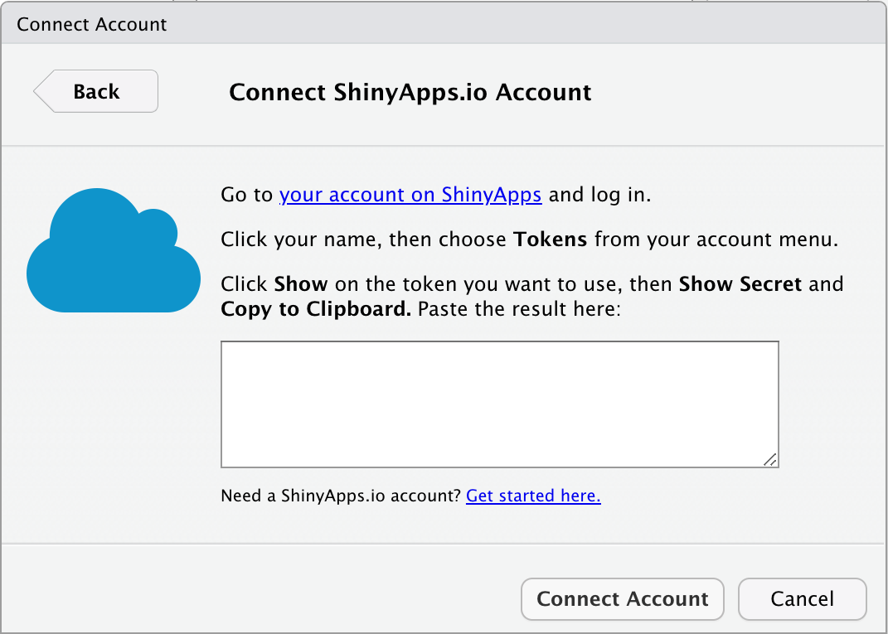

# Sharing your Apps {#sharing}

## shinyapps.io

{style="max-width:300px; float: right;"}

1. Open **`Tools > Global Options ...`**
2. Go to the **Publishing** tab 
3. Click the **Connect** button and choose ShinyApps.io
4. Click on the link to [go to your account](https://www.shinyapps.io/){target="_blank"}
5. Click the **Sign Up** button and **Sign up with GitHub** 
6. You should now be in your shinyapps.io dashboard; click on your name in the upper right and choose **Tokens**
7. Add a token
8. Click **Show** next to the token and copy the text to the clipboard
    
9. Go back to RStudio and paste the text in the box and click **Connect Account**
10. Make sure the box next to "Enable publishing..." is ticked, click **Apply**, and close the options window
˙
You can test this by creating a simple app. If you have the shinyintro package, use the code below.


```r
shinyintro::newapp("mytestapp", "input_demo")
```

{style="max-width:300px; float: right;"}

Open the app.R file and go to **`File > Publish...`** in the menu (or click on the blue icon in the upper right corner of the source pane). Make sure these are the right files for your app, edit the title if you want, and click **Publish**. A web browser window will open after a few seconds showing your app online! You can now share it with your friends and colleagues.

<div class="info">
<p>If publishing fails, check the Console pane. If you already have too many apps on shinyapps.io, you’ll see the message, “You have reached the maximum number of applications allowed for your account.” You can archive some of your apps from the shinyapps.io dashboard if this is the problem.</p>
</div>

## Self-hosting a shiny server

Setting up a shiny server is beyond the scope of this class, but if you have access to one, you can ask the administrator how to access the correct directories and upload your app directories there.

This solution is good if you want to save data locally and do not want to use Google Sheets. You can't save data locally on shinyapps.io.

<div class="info">
<p>If you save data locally on a shiny server, you may need to change the owner or permissions of the directory you save data in so that the web user can write to it. Ask the administrator of the server for help if this doesn’t make any sense to you.</p>
</div>

## GitHub

GitHub is a great place to organise and share your code using <a class='glossary' target='_blank' title='A way to save a record of changes to your files.' href='https://psyteachr.github.io/glossary/v#version-control'>version control</a>. You can also use it to host Shiny app code for others to download and run on their own computer with RStudio.

See [Appendix B](#setup-git) for instructions on how to set up git and a GitHub account.

## In an R package

## Glossary {#glossary-sharing}


## Exercises {#exercises-sharing}

### 1. Shinyapps.io

* Upload another demo app to shinyapps.io.
* Check that you can access it online.
* Archive the app in the shinyapps.io dashboard.


